:::::::::::::::::::::::::::::::::::::: questions 

- How can Napari be used to view images?
- How can I interact Napari through the console or via Jupyter Lab?

::::::::::::::::::::::::::::::::::::::::::::::::

::::::::::::::::::::::::::::::::::::: objectives

- Use Napari to open images
- Navigate the Napari viewer (pan/zoom/swapping between 2D and 3D views…)
- Change colormap (LUT) in Napari
- Explain the main parts of the Napari user interface
- Install plugins from Napari Hub

::::::::::::::::::::::::::::::::::::::::::::::::


In this section, we will open up with Napari in a number of 
different ways, and understand how it represents images, as well as 
measurements derived for it.


## Opening Napari

Let's get started by opening a new Napari window - you should have already 
followed the [installation instructions](../learners/setup.md). Note this can 
take a while the first time, so give it a few minutes!

```bash
# Change micro-sam to wherever you put your environment
cd napari-ai-workshop
source .venv/bin/activate
napari
```

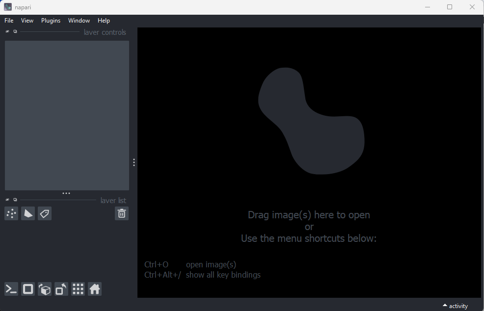{alt="A screenshot of the default Napari user 
interface"}

## Opening images

Napari comes with some example images - let's open one now. Go to the top 
menu-bar of Napari and select:  
`File > Open Sample > napari builtins > Cells (3D+2Ch)`

You should see a fluorescence microscopy image of some cells:

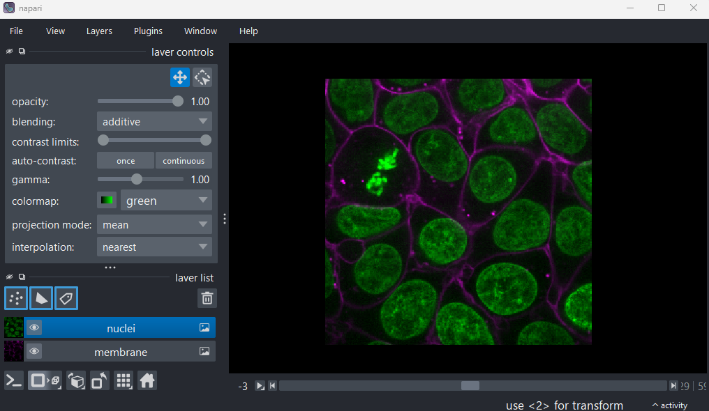{alt="A screenshot of a fluorescence microscopy image 
of some cells in Napari"}

## Napari's User interface

Napari's user interface is split into a few main sections, as you can see in the 
diagram below (note that on Macs the main menu will appear in the upper ribbon, 
rather than inside the Napari window):

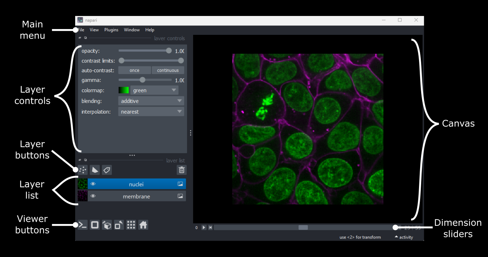{alt="A screenshot of Napari with the main user 
interface sections labelled"}

Let's take a brief look at each of these sections - for full information see the 
[Napari documentation](https://napari.org/stable/tutorials/fundamentals/viewer.html).

## Main menu

We already used the main menu in the last section to open a sample image. The 
main menu contains various commands for opening images, changing preferences and 
installing plugins (we'll see more of these options in later episodes).

## Canvas

The canvas is the main part of the Napari user interface. This is where we 
display and interact with our images. 

Try moving around the cells image with the following commands:
```
Pan - Click and drag
Zoom - Scroll in/out (use the same gestures with your mouse 
                      that you would use to scroll up/down 
                      in a document)
```

## Dimension sliders

Dimension sliders appear at the bottom of the canvas depending on the type of 
image displayed. For example, here we have a 3D image of some cells, which 
consists of a stack of 2D images. If we drag the slider at the bottom of the 
image, we move up and down in this stack:

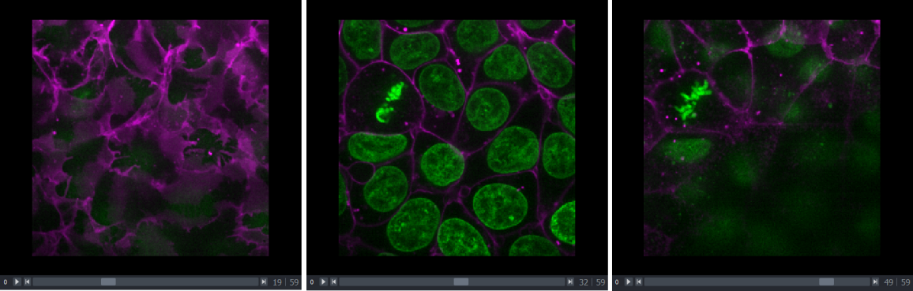{alt="Three screenshots of the cells image in napari, at 
different z depths"}

Pressing the arrow buttons at either end of the slider steps through one slice 
at a time. Also, pressing the 'play' button at the very left of the slider moves 
automatically through the stack until pressed again.

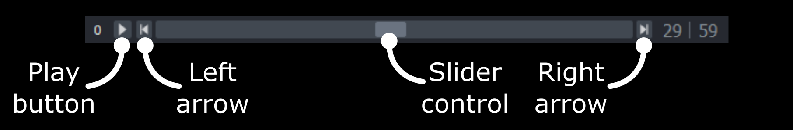{alt="Closeup of Napari's dimension slider with
labels" width='80%'}
sand
More sliders can appear if our image has more 
dimensions (e.g. time series, or further channels).

## Viewer buttons

The viewer buttons (the row of buttons at the bottom left of Napari) control 
various aspects of the Napari viewer:

### Console {alt="A screenshot of Napari's console button" height='30px'}

This button opens Napari's built-in python console.

### 2D/3D {alt="A screenshot of Napari's 2D button" height='25px'}  / {alt="A screenshot of Napari's 3D button" height='25px'}

This switches the canvas between 2D and 3D display. Try switching to the 3D view 
for the cells image:

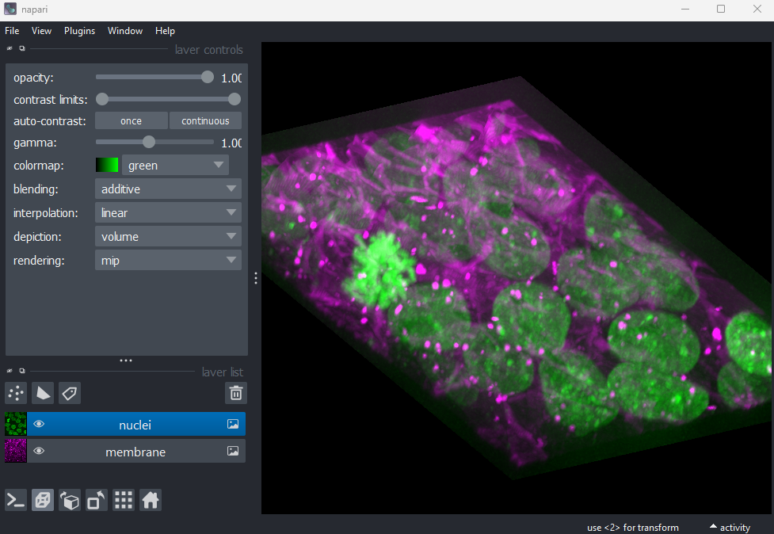{alt="A screenshot of 3D cells in Napari"}

The controls for moving in 3D are similar to those for 2D:
```
Rotate - Click and drag
Pan - Shift + click and drag
Zoom - Scroll in/out
```

### Roll dimensions {alt="A screenshot of Napari's roll dimensions button" height='25px'} 

This changes which image dimensions are displayed in the viewer. For example, 
let's switch back to the 2D view for our cells image and press the roll 
dimensions button multiple times. You'll see that it switches between different 
orthogonal views (i.e. at 90 degrees to our starting view). Pressing it 3 times 
will bring us back to the original orientation.

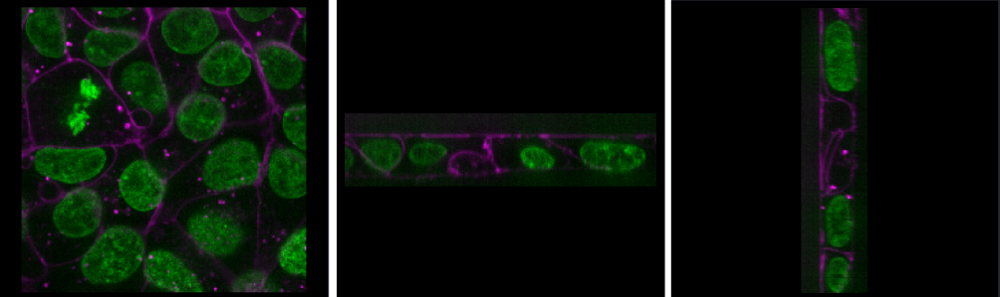{alt="Three screenshots of the cells image in napari, 
with different axes being visualised"}

### Transpose dimensions {alt="A screenshot of Napari's transpose dimensions button" height='25px'}

This button swaps the two currently displayed dimensions. In our cells image,
this means the x and y axis are switched. Pressing the button 
again brings us back to the original orientation.

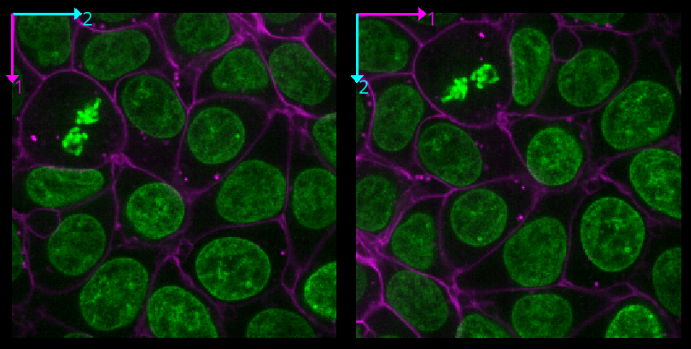{alt="Two screenshots of the cells image in napari, 
with dimensions swapped"}

### Grid {alt="A screenshot of Napari's grid button" height='25px'}

This button displays all image layers in a grid (+ any additional layer types,
as we'll see [later in the episode](#layer-buttons)). Using this for our cells 
image, we see the nuclei (green) displayed next to the cell membranes (purple), 
rather than on top of each other.

### Home {alt="A screenshot of Napari's home button" height='25px'}

This button brings the canvas back to its default view. This is useful if you 
have panned/zoomed to a specific region and want to quickly get back to an 
overview of the full image.

## Layer list

Now that we've seen the main controls for the viewer, let's look at the layer 
list. 'Layers' are how Napari displays multiple items together in the viewer. 
For example, currently our layer list contains two items - 'nuclei' and 
'membrane'. These are both `Image` layers and are displayed in order, with 
the nuclei on top and membrane underneath.

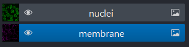{alt="A screenshot of Napari's layer list, showing two 
image layers named 'nuclei' and 'membrane'"}

We can show/hide each layer by clicking the eye icon on the left side of their 
row. We can also rename them by double clicking on the row.

We can change the order of layers by dragging and dropping items in the layer 
list. For example, try dragging the membrane layer above the nuclei. You should 
see the nuclei disappear from the viewer (as they are now hidden by the membrane 
image on top).

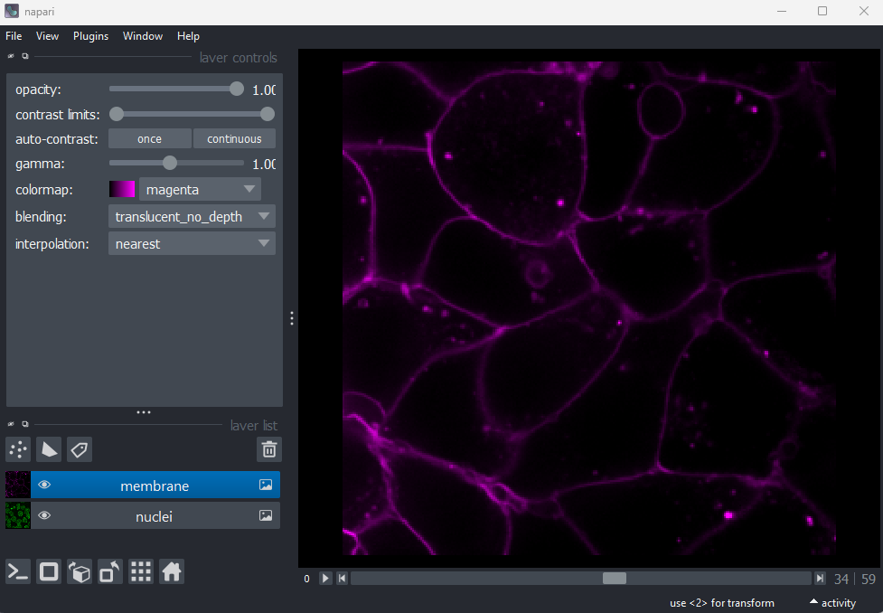{alt="A screenshot of Napari with the nuclei and 
membrane layer swapped"}

Here we only have `Image` layers, but there are many more types like `Points`, 
`Shapes` and `Labels`, some of which we will see [later in the episode
](#layer-buttons).


## Layer controls

::::::::::::::::::::::::::::::::::::: instructor
### Skip most of the sections below
There is a lot more information here that we have time for during the session
so I would suggest going through these elements very briefly and/or
skipping altogether. If they want to look at the challenges themselves after
we can point that we will have them.
:::::::::::::::::::::::::::::::::::::::::::::::::

Next let's look at the layer controls - this area shows controls only for the 
currently selected layer (i.e. the one that is highlighted in blue in the layer 
list). For example, if we click on the nuclei layer then we can see a 
`colormap` of green, while if we click on the membrane layer we see a 
`colormap` of magenta.

Controls will also vary depending on layer type (like `Image` vs `Points`) as we 
will see [later in this episode](#layer-buttons).

Let's take a quick look at some of the main image layer controls:

### Opacity  
This changes the opacity of the layer - lower values are more transparent. For 
example, reducing the opacity of the membrane layer (if it is still on top of 
the nuclei), allows us to see the nuclei again.

### Contrast limits 
The contrast limits adjust what parts of the image we can see and how bright 
they appear in the viewer. Moving the left node adjusts what is shown as fully 
black, while moving the right node adjusts what is shown as fully bright.


### Colormap
Along with the contrast limits, the colormap determines how pixels values are
assigned colors on the display. Clicking in the dropdown shows a wide range 
of options that you can swap between.

### Blending
:::::::::::::::::: instructor
#### Skip this section on blending
::::::::::::::::::
This controls how multiple layers are blended together to give the final result 
in the viewer. There are [many different options to choose 
from](https://napari.org/stable/guides/layers.html#blending-layers). For 
example, let's put the nuclei layer back on top of the membrane and change 
its blending to 'opaque'. You should see that it now completely hides the 
membrane layer underneath. Changing the blending back to 'additive' will allow 
both the nucleus and membrane layers to be seen together again.

::::::::::::::::::::::::::::::::::::: challenge 

## Using image layer controls

Adjust the layer controls for both nuclei and membrane to give the result below:

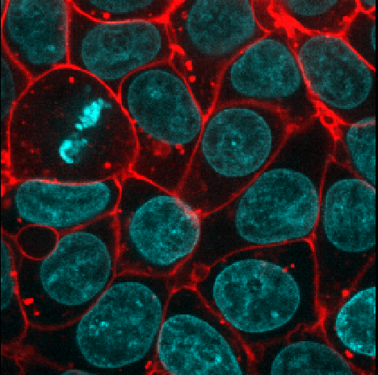{alt="Cells image with blue nuclei and bright 
red membranes"}

:::::::::::::::::::::::: solution 
 
- Click on the nuclei in the layer list
- Change the colormap to cyan
- Click on the membrane in the layer list
- Change the colormap to red
- Move the right contrast limits node to the left to make the membranes 
appear brighter

:::::::::::::::::::::::::::::::::

::::::::::::::::::::::::::::::::::::::::::::::::

## Layer buttons
:::::::::::::::::::: instructor
#### Just go briefly over the types of layers
Mention that layers can be made up of different objects depending on 
what they represent. We are looking at an image but could annotate with points/shapes,
and we will make a labels layer in our segmentations in a later episode.
::::::::::::::::::::

So far we have only looked at `Image` layers, but there are many more types 
supported by Napari. The layer buttons allow us to add additional layers of 
these new types:

### Points {alt="A screenshot of Napari's point layer button" height='30px'}

This button creates a new 
[points layer](https://napari.org/stable/howtos/layers/points.html). This can 
be used to mark specific locations in an image.

### Shapes {alt="A screenshot of Napari's shape layer button" height='30px'} 

This button creates a new 
[shapes layer](https://napari.org/stable/howtos/layers/shapes.html). Shapes can 
be used to mark regions of interest e.g. with rectangles, ellipses or lines.

### Labels {alt="A screenshot of Napari's labels layer button" height='30px'}

This button creates a new 
[labels layer](https://napari.org/stable/howtos/layers/labels.html). This is 
usually used to label specific regions in an image e.g. to label individual 
nuclei.

### Remove layer {alt="A screenshot of Napari's delete layer button" height='30px'}  

This button removes the currently selected layer (highlighted in blue) from the 
layer list.

:::::::::::::::::::::::::::::::::::::: callout

### Other layer types

Note that there are some layer types that can't be added via clicking buttons
in the user interface, like
[surfaces](https://napari.org/stable/howtos/layers/surface.html),
[tracks](https://napari.org/stable/howtos/layers/tracks.html) and 
[vectors](https://napari.org/stable/howtos/layers/vectors.html). These require 
calling python commands in Napari's console or an external python script.

::::::::::::::::::::::::::::::::::::::::::::::::

::::::::::::::::::::::::::::::::::::: challenge 

## Point layers

Let's take a quick look at one of these new layer types - the `Points` layer.

Add a new points layer by clicking the points button. Investigate the different 
layer controls - what do they do? Note that hovering over buttons will usually 
show a summary tooltip.

Add points and adjust settings to give the result below:

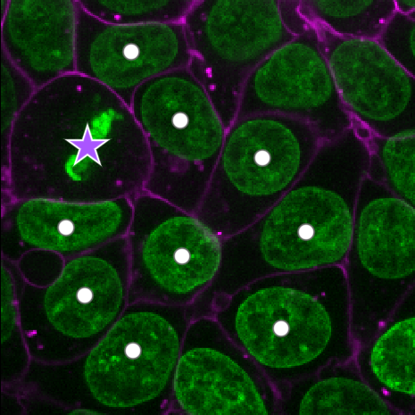{alt="Cells image with points marking multiple nuclei"}

:::::::::::::::::::::::: solution 
 
- Click the 'add points' button {alt="Screenshot of Napari's add points button" height='30px'}
- Click on nuclei to add points on top of them
- Click the 'select points' button {alt="Screenshot of Napari's select points button" height='30px'}
- Click on the point over the dividing nucleus
- Increase the point size slider
- Change its symbol to star
- Change its face colour to purple
- change its edge colour to white

:::::::::::::::::::::::::::::::::
:::::::::::::::::::::::::::::::::

## Napari plugins

:::::::::::::::::::::::::: instructor
#### Explanation on plugins
Explain that they will not be able to see the plugin explorer due to an issue
where the micro-sam plugin seems to disable search for plugins through napari.
Use a conda environment, tell them we have put alternative instructions
to install in case you want to explore plugins but many would be available
to install at command line, so we will go to napari-hub and show
plugins page saying that this is what it looks like in case you want to try out 
later.
::::::::::::::::::::::::::

How can we quickly assess the pixel values in an image? We could hover over 
individual pixels in the Napari window, or we could print the array 
into Napari's console or in a Jupyter notebook, but these are hard to 
interpret at a glance. A much better option is to use an image histogram.

To do this, we will have to install a new plugin for Napari. Remember from the 
[Imaging Software episode](imaging-software.md) that plugins add new features 
to a piece of software. Napari has hundreds of plugins available on the 
[napari hub](https://www.napari-hub.org/) website.

Let's start by going to the napari hub and searching for 'matplotlib':

{alt="Screenshot of searching 'matplotlib' on napari hub"}

You should see 'napari Matplotlib' appear in the list (if not, try scrolling 
further down the page). If we click on `napari matplotlib` this opens a summary 
of the plugin with links to the documentation and github repository containing 
the plugin's source code.

Now that we've found the plugin we want to use, let's go ahead and install it 
in Napari. Note that some plugins have special requirements for installation, 
so it's always worth checking their napari hub page for any extra instructions. 
In the top menu bar of Napari select:  
`Plugins > Install/Uninstall Plugins...`

{alt="Screenshot of plugin installation window in Napari"}

This should open a window summarising all installed plugins (at the top) and all 
available plugins to install (at the bottom). If we search for 'matplotlib' in 
the top searchbar, then 'napari-matplotlib' will appear under 'Available 
Plugins'. Press the blue install button and wait for it to finish. **You'll then 
need to close and re-open Napari.**

If all worked as planned, you should see a new option in the top menubar under:  
`Plugins > napari Matplotlib`

:::::::::::::::::::::: instructor
### Highlight what to look for in a plugin
This section is good just to touch upon what to consider when looking
at plugins. We won't have time to do the challenge.
::::::::::::::::::::::

::::::::::::::::::::::::::::::::::::: challenge 

## Finding plugins

Napari hub contains hundreds of plugins with varying quality, written by many 
different developers. It can be difficult to choose which plugins to use!

- Search for cell tracking plugins on [Napari hub](https://www.napari-hub.org/)
- Look at some of the plugin summaries, documentation and github repositories
- What factors could help you decide if the plugin is well maintained?
- What factors could help you decide if the plugin is popular with Napari users?

:::::::::::::::::::::::: solution 

## Solution

### Is a plugin well maintained?

Some factors to look for:

**Last updated**  
Check when the plugin was last updated - was it recently? This is shown in the 
search list summary and in the left sidebar when you open the plugin's page on 
napari-hub.

**Documentation**  
Is the plugin summary (+ any linked documentation) detailed enough to explain 
how to use the plugin?

### Is a plugin popular?

Some factors to look for:

**Stars on github**  
If you open a plugin's linked github repository, you can see the number of 
'stars' in the top right. More stars tend to indicate a plugin is more popular - 
although this isn't always the case! Github is mainly used by plugin developers, 
so a plugin with few stars may still have many people using it. 

**Image.sc**  
It can also be useful to search the plugin's name on the 
[image.sc](https://forum.image.sc/) forum to browse relevant posts and see if 
other people had good experiences using it. Image.sc is also a great place to 
get help and advice from other plugin users, or the plugin's developers.

:::::::::::::::::::::::::::::::::
:::::::::::::::::::::::::::::::::


::::::::::::::::::::::::::::::::::::: keypoints 

- Napari's user interface is split into a few main sections including the 
canvas, layer list, layer controls...
- Layers can be of different types e.g. `Image`, `Point`, `Label`
- Different layer types have different layer controls
- Lots of additional functionality for Napari are available through 
plugins extendng its capability. 

::::::::::::::::::::::::::::::::::::::::::::::::

