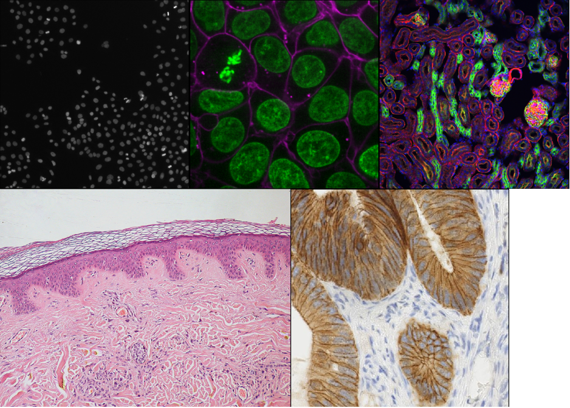

:::::::::::::::::::::::::::::::::::::: questions 

- What are the different software options for viewing microscopy images?

::::::::::::::::::::::::::::::::::::::::::::::::

::::::::::::::::::::::::::::::::::::: objectives

- Explain the pros and cons of different image visualisation tools (e.g. ImageJ, 
Napari and proprietary options)

::::::::::::::::::::::::::::::::::::::::::::::::

## Choosing the right tool for the job

Light microscopes can produce a very wide range of image data, for example:

- 2D or 3D
- Time series or snapshots
- Different channels
- Small to large datasets

{alt="A mosaic of screenshots of some of Napari's 
included sample data" width='80%'}

With such a wide range of data, there comes a huge variety of software that can 
work with these images. Different software may be specialised to specific types 
of image data, or to specific research fields. There is no one 'right' software 
to use - it's about choosing the right tool for yourself, your data, and your 
research question!

Some points to consider when choosing software are:

- **What is common in your research field?**  
Having a good community around the software you work with can be extremely 
helpful - so it's worth considering what is popular in your department, 
or in relevant papers in your field.

- **Open source or proprietary?**  
It's important to consider if the software you are using is open-source
or proprietary (requiring a one-off payment or a regular subscription fee to 
use). Open source means it is more freely available and likely more accessible 
to a larger group of researchers, but it may not be as robust or stable as
software commercially developed by large team, particularly if you are 
interested in a very specific feature that it provides. Open source software
often will rely on more open file formats and workflows, and they are designed
to be extended by the community.

- **Support for image types?**  
For example, does it support 3D images, or timeseries?

- **Can it be automated/customised/extended?**  
Can you automate certain steps with your own scripts or plugins? **Scripts** 
are lists of commands to be carried out by a piece of software e.g. 
load an image, then threshold it, then measure its size...These are often used
to automate processes, especially for high throughput studies. **Plugins** add
optional new features to a piece of software (rather than automating use 
of existing features). They're designed to be reusable so other members 
of the community can easily benefit from these new features. Both of these
components are useful to make sure your analysis steps can be easily shared and 
reproduced by other researchers. 

As always, the right software to use will depend on your preference, your data 
and your research question. This being said, we will only use open-source 
software in this course, and we encourage using open-source software where 
possible.

## Fiji/ImageJ and Napari

While there are many pieces of software to choose from, two of the most popular 
open-source options are [Fiji/ImageJ](https://imagej.net/software/fiji/) and 
[Napari](https://napari.org/).
They are both:

- Freely available
- 'General' imaging software i.e. applicable to many different research fields
- Supporting a wide range of image types
- Customisable with scripts + plugins

Both are great options for working with a wide variety of images - so why 
choose one over the other? Some of the main differences are listed below if you 
are interested:

:::::::::::::::::::::::::::::::::::::: spoiler

### Differences between Fiji/ImageJ and Napari

**Python vs Java**  
A big advantage of Napari is that it is made with the Python programming 
language (vs Fiji/ImageJ which is made with Java). In general, this makes it 
easier to extend with scripts and plugins as Python tends to be more widely used 
in the research community. It also means Napari can easily integrate with other 
python tools e.g. Python's popular machine learning libraries.

**Maturity**    
Fiji/ImageJ has been actively developed 
[for many years now (>20 years)](https://imagej.net/software/imagej/), while 
Napari is a more recent development 
[starting around 2018](https://napari.org/stable/community/team.html#project-history). 
This difference in age comes with pros and cons - in general, it means that the 
core features and layout of Fiji/ImageJ are very well established, and less 
likely to change than Napari. With Napari, you will likely have to adjust your 
image processing workflow with new versions, or update any scripts/plugins more 
often. Equally, as Napari is new and rapidly growing in popularity, it is 
quickly gaining new features and attracting a wide range of new plugin 
developers.

**Built-in tools**    
Fiji/ImageJ comes with many image processing tools built-in by default - e.g. 
making image histograms, thresholding and gaussian blur. While Napari is more 
minimal by default and mostly focusing on image display, the core functionality 
is continuing to evolve. Some of these features which have in the past required
installation of additional plugins are now being built in.

**Specific plugins**   
There are excellent plugins available for Fiji/ImageJ and Napari that focus on 
specific types of image data or processing steps. The availability of a specific 
plugin will often be a deciding factor on whether to use Fiji/ImageJ or Napari 
for your project.

**Ease of installation and user interface**  
As Fiji/ImageJ has been in development for longer, it tends to be simpler to 
install than Napari (especially for those with no prior Python experience). In 
addition, as it has more built-in image processing tools, it tends to be simpler 
to use fully from its user interface. Napari meanwhile is often strongest when 
you combine it with some Python scripting (although this isn't required for many 
workflows!)

::::::::::::::::::::::::::::::::::::::::::::::::

For this lesson, we will use Napari as our software of choice. It's worth 
bearing in mind though that Fiji/ImageJ can be a useful alternative - and many 
workflows will actually use both Fiji/ImageJ and Napari together! Again, it's 
about choosing the right tool for your data and research question.

::::::::::::::::::::::::::::::::::::: keypoints 

- There are many software options for light microscopy images
- Considerations when choosing a software for your analysis include 
functionality, cost, availability, and customisation.
- Napari and Fiji/ImageJ are popular open-source options

::::::::::::::::::::::::::::::::::::::::::::::::

