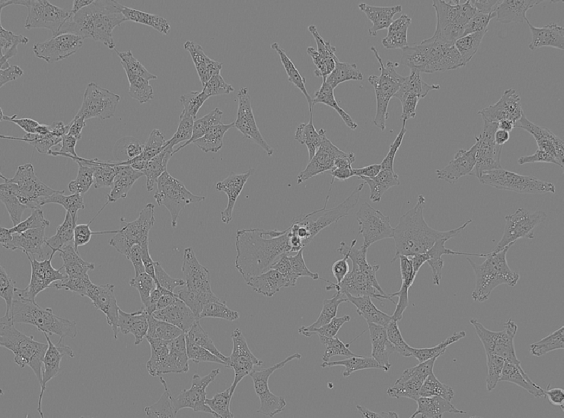
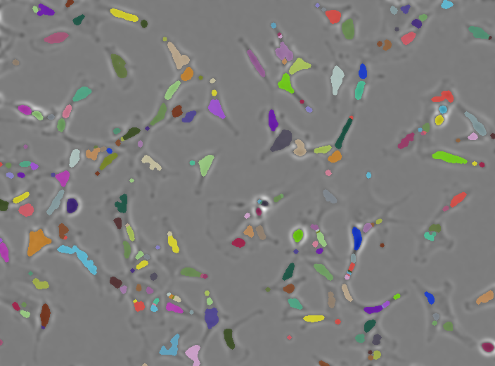
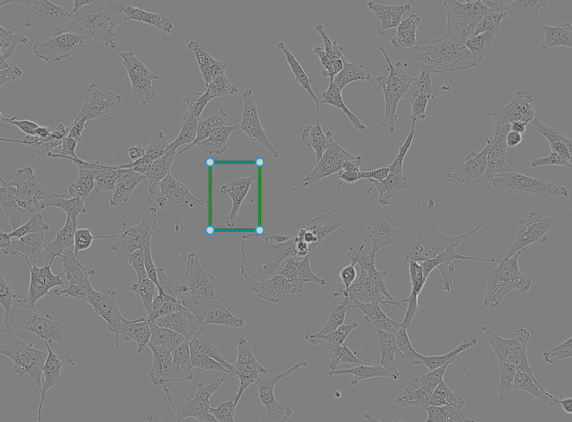
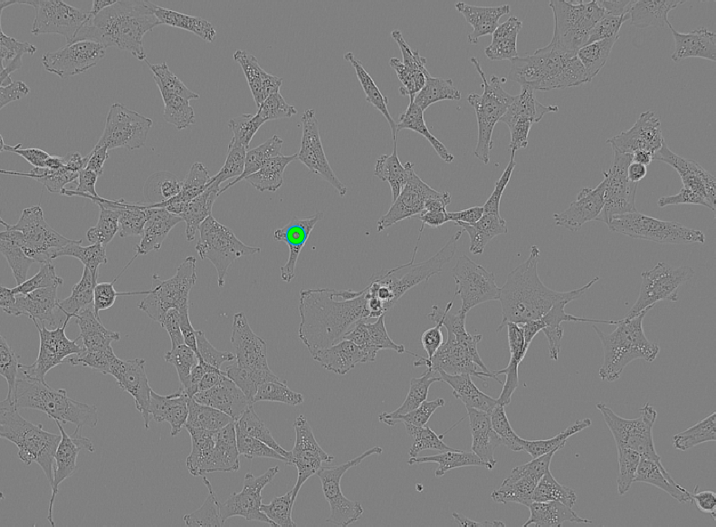
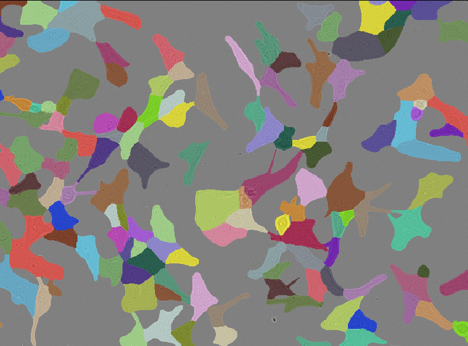

:::::::::::::::::::::::::::::::::::::: questions 

- What is μSAM and how does it differ from classical image‑processing?
- When do traditional image analysis methods fail, and how can AI models help in those cases?

::::::::::::::::::::::::::::::::::::::::::::::::

::::::::::::::::::::::::::::::::::::: objectives

- Think about when classical methods succeed or fail  
- Use μSAM area and point prompts to aid segmentation and explore automatic mode, to segment a live‑cell image inside napari.

::::::::::::::::::::::::::::::::::::::::::::::::

## Segment unlabeled live cells

In this episode we will use a deep-learning model to segment an image of unlabeled live cells.

But before we do so, let's apply traditional image analysis methods on this image to see how these perform.

Create a new notebook called `livecells.ipynb` and run the code below to open the unlabeled live-cell sample image that comes with the μSAM plugin. 

``` python
# Import napari 
import napari
```

``` python
# Open a sample image in the viewer
viewer = napari.Viewer()
viewer.open_sample("micro_sam", "micro_sam-livecell")
```

The output should look like this.
``` output
[<Image layer 'livecell' at 0x2352a276ba0>]  
```

and the image below should open in the napari viewer.

{alt="Screenshot of LIVECell sample image from micro-sam in Napari"}  


For details on the dataset this image came from see https://doi.org/10.1038/s41592-021-01249-6.
Let's try to segment these cells using the image analysis approaches we explored in the first half of the workshop.

### Import the tools we need from skimage

We will import the tools from `skimage`. Except `disk` from `skimage.morphology`, we used all of these in the [previous episode](instance-segmentation-classic.Rmd).

``` python
# Import the functions we need from scikit-image
from skimage.filters import threshold_otsu, gaussian
from skimage.morphology import erosion, disk
from skimage.measure import label
from skimage.segmentation import expand_labels
```

:::::::::::::::::::::::::challenge

## Disk vs Ball Structure Element  

You may notice that in this part of the workshop we import `disk` from `skimage.morphology`, whereas earlier we used a `ball`.

Why should you use a disk‑shaped footprint rather than a ball‑shaped footprint when performing morphological operations on this image?

:::::::::::::::::::::::::solution 
## solution

Morphological operations rely on a structuring element whose shape must match the dimensionality of the data. Because the image we are working with is two‑dimensional, the appropriate structuring element is a disk footprint (a circular shape defined in the x–y plane).

A ball footprint, by contrast, is a three‑dimensional structuring element. It assumes the presence of a z‑axis and is only meaningful when working with three-dimensional images.

:::::::::::::::::::::::::::::::::
:::::::::::::::::::::::::::::::::

We are now going to use these tools to create an instance segmentation of the cells, following the same steps we used in the previous episode.

### Smooth the image

``` python
# Access the image from the viewer
image = viewer.layers["livecell"].data
```

### Compute a threshold and create a mask

``` python
# Smooth image
blurred = gaussian(image, sigma=3)
viewer.add_image(blurred)

# Compute threshold
threshold = threshold_otsu(blurred)

# Create mask
mask = blurred < threshold

# Add to viewer
viewer.add_labels(mask)
```

### Erode the mask and label instances

``` python
# Erode mask 
eroded_mask = erosion(mask, footprint=disk(3))

# Label instances
eroded_labels = label(eroded_mask)

# Add to viewer
viewer.add_labels(eroded_labels)
```

### Dilate labels 

``` python
# Dilate labels
instance_seg = expand_labels(eroded_labels, 3)

# Add to viewer
viewer.add_labels(instance_seg)
```

Below is the result of applying our traditional workflow to the unlabeled live‑cell image.

{alt="Results from our traditional segmentation pipeline"}

While many of the cell regions have been identified. Some cells have been largely missed out or broken apart.

This splitting is called over‑segmentation, as shown in the example highlighted in the red box below.

{alt="Results from our traditional segmentation pipeline with box around a cell that has been over segmented"}


:::::::::::::::::::::::::challenge

## Segmenting an unlabeled image

Why do classical image‑processing methods struggle here?

:::::::::::::::::::::::::solution

## Solution

Traditional image-processing methods depend on clear intensity differences between structures of interest and the background.

In fluorescence imaging, traditional methods usually work well because labeled structures appear bright and distinct. 

But in label‑free imaging, cells are more heterogeneous in appearance and often have only subtle intensity differences from the background (with some areas being brighter, and others darker in this sample), making thresholding unreliable.

::::::::::::::::::::::::: 
:::::::::::::::::::::::::

Image analysis methods often rely on labels like fluorescent proteins. However, labeling may not always be possible or desirable.

Label‑free settings are an example of situations in which traditional image analysis methods of microscopy images can become significantly harder. 

## AI-based segmentation methods

AI‑based segmentation methods can address these limitations.

AI models used for image segmentation are trained on large collections of images paired with "ground‑truth" segmentation masks. 

These masks may come from manual annotation or semi‑automated annotation refined by experts.

During training, the model repeatedly predicts segmentation masks and compares them to the ground truth. 

The difference between the prediction and the ground‑truth mask is measured and the model then adjusts its internal parameters to reduce this error. 

Once trained, the model can apply what it learned to new images.

The nature and diversity of the training data determines how well the model generalises to new cell types and imaging modalities.

## μSAM

The [Segment Anything Model (SAM)](https://segment-anything.metademolab.com/) was developed by Meta AI. It was released in 2023 alongside the dataset, a collection of over 1.1 billion segmentation masks across 11 million images.

[μSAM](https://computational-cell-analytics.github.io/micro-sam/micro_sam.html) is a microscopy‑adapted version of the Segment Anything Model designed specifically for biological images. 

As a napari plugin, μSAM integrates directly into the napari image viewer. You can load images, add area or point "prompts", run automatic segmentation, and immediately inspect or refine the results. 

### Open Annotator 2d

Remove all layers except for the `livecells` layer and open the μSAM annotator.

plugins > Segment Anything for Microscopy > Annotator 2d

This opens a _Annotator 2d_ window, where you can select an image and model, and interactively segment objects.

In the layer list you will see a number of new layers appear:
- prompts
- point_prompts
- committed_objects
- auto_segmentation
- current_object

We will have a look at these layers after computing the "embeddings".

### Embeddings

When μSAM processes an image, it needs to compute the image's embeddings. The embeddings contain a compact, multi-dimensional representation of the imaging data that captures it's features.

This is a computationally expensive step that is done only once per image for the specific model you are using.

After the embedding is computed, Because the embedding is reused for every prompt, μSAM can deliver fast, interactive segmentation.

In the _Annotator 2d_ window, have a look at the _Embedding Settings_, here you can load pre-computed embeddings and select things like the size of the model (the bigger the model the longer it will take to compute the embeddigns).#

For this workshop we will use the default settings to compute the embeddings by clicking on _Compute Embeddings_.

### Area prompts

Now that we have computed the embeddings, let's first explore the _area prompts_.

Area prompts let you draw a region on the image and μSAM will propose a segmentation for the object inside that region.


#### Box prompt

We start with the simplest area prompt: the box prompt.



Creating a box prompt:
- Select the _prompts_ layer from the layer list and pick the box tool  
- Click and drag on the image to draw a rectangular region around one cell
- In the _Annotator 2d_ window click on _Segment Object_
- To "commit" the object, click _Commit Object_ in the Annotator window

:::::::::::::::::::::::::challenge

## Shortcuts, multiple objects at once, and polygons

- Use keyboard shortcuts to segment and commit an object.
- Use multiple box prompts at once to segment multiple objects.
- Use a polygon prompt to segment an irregularly shaped cell

:::::::::::::::::::::::::solution

## solution

**Using shortcuts**
After creating a box prompt, press `S` to segment and `C` to commit the object.

**Segmenting multiple objects at once**
In the prompts layer, draw several box prompts before running Segment Object. μSAM will generate a segmentation for each box simultaneously. After reviewing them, click Commit Object(s) to add all segmentations at once.

**Using a polygon prompt**
Select the polygon tool in the prompts layer. Click around the outline of an irregular cell to define a custom shape. Once the polygon is closed, run Segment Object to generate the segmentation.

::::::::::::::::::::::::: 
:::::::::::::::::::::::::

### Point prompts

Point prompts let you guide μSAM using single points rather than areas.

They are especially useful when cells are small, touching, or hard to isolate with boxes.

There are two types of point prompts:
- Positive points 
- Negative points 

Creating point prompts
- Select the point_prompts layer in the layer list
- Choose the positive point tool
- Click on the image to place a point
- In the _Annotator 2d_ window, click _Segment Object_
- Commit the object if the segmentation looks correct

Positive points should be placed inside the cell you want to segment.

Negative points help μSAM avoid including neighbouring cells or background regions.

The image shows a single positive point prompt placed on one of the cells.


:::::::::::::::::::::::::challenge

## Batched segmentation using point prompts

What happens when you place point prompts in multiple cells and click _Segment Object_ without ticking the _batched_ option?

What happens if you now toggle it on and click on _Segment Object_ again?

:::::::::::::::::::::::::solution

## solution

By default μSAM treats all point prompts as belonging to one single object.

With batched enabled, μSAM treats each point prompt independently and μSAM returns one segmentation per point, producing multiple separate cell masks.

::::::::::::::::::::::::: 
:::::::::::::::::::::::::

### Automatic segmentation

Automatic segmentation lets μSAM propose all cell masks in the image without any prompts.

To run automatic segmentation using the default settings:
- In the _Annotator 2d_ window click on _Automatic Segmentation_

μSAM will generate a full‑image segmentation and place it in the auto_segmentation layer

If automatic segmentation clashes with existing committed objects (overlaps, duplicates):
- Delete the `committed_objects` layer
- Re‑run Automatic Segmentation
- Commit again (μSAM will create a new committed‑objects layer automatically)

The results of the automatic segmentation will look like the image below.



### Automatic segmentation in a Jupyter notebook

μSAM also supports automatic segmentation directly from Python. 

This gives you a full‑image segmentation directly in Jupyter, using the same μSAM model and settings as the napari plugin.

Create a new Jupyter notebook called `livecells-microsam.ipynb` to run the code blocks below.

``` python
# import packages
from micro_sam.automatic_segmentation import get_predictor_and_segmenter, automatic_instance_segmentation
import napari
```

``` python
viewer = napari.Viewer()
image = viewer.layers["livecell"].data
```

``` python
# Load model
predictor, segmenter = get_predictor_and_segmenter(model_type="vit_b_lm")

# Run automatic segmentation
auto_seg = automatic_instance_segmentation(
    predictor=predictor,
    segmenter=segmenter,
    input_path=image        # you can also pass a file path
)
# Add to viewer
viewer.add_labels(auto_seg)
```

### References

Archit, A., Freckmann, L., Nair, S., Khalid, N., Hilt, P., Rajashekar, V., Freitag, M., Teuber, C., Spitzner, M., Tapia Contreras, C., Buckley, G., von Haaren, S., Gupta, S., Grade, M., Wirth, M., Schneider, G., Dengel, A., Ahmed, S., & Pape, C. (2025). Segment Anything for Microscopy. Nature methods, 22(3), 579–591. https://doi.org/10.1038/s41592-024-02580-4

Edlund, C., Jackson, T. R., Khalid, N., Bevan, N., Dale, T., Dengel, A., Ahmed, S., Trygg, J., & Sjögren, R. (2021). LIVECell-A large-scale dataset for label-free live cell segmentation. Nature methods, 18(9), 1038–1045. https://doi.org/10.1038/s41592-021-01249-6


::::::::::::::::::::::::::::::::::::: keypoints 

- Classical image analysis methods often fail on label‑free images with subtle contrast.
- μSAM adapts Segment Anything Model (SAM) for microscopy and integrates it into napari, providing robust segmentation tools for biological images.
- μSAM supports area and point prompts, plus full image automatic segmentation.
- Initial embedding step can be slow, especially with larger models.

::::::::::::::::::::::::::::::::::::::::::::::::
